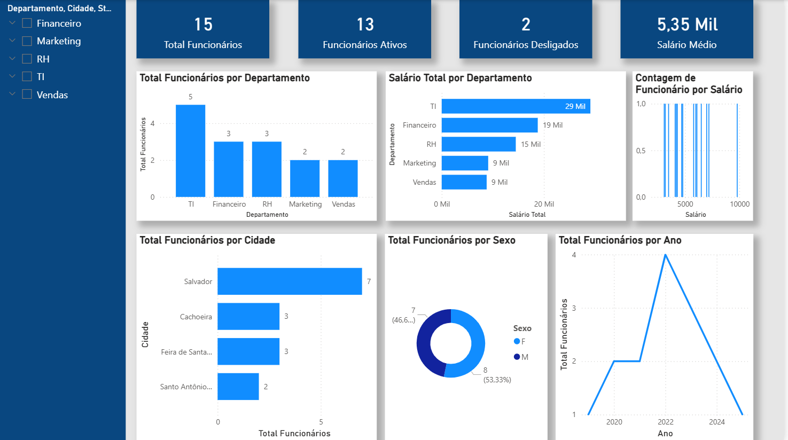

# 📊 HR Dashboard | Power BI

## 📌 Overview

This project presents an HR dashboard developed in Power BI to analyze workforce indicators and support decision-making.

## 📈 KPIs

* Total Employees
* Active Employees
* Terminated Employees
* Average Salary

## 📊 Dashboard Analysis

* Employees by Department
* Total Salary by Department
* Employees by City
* Gender Distribution
* Hiring Timeline

## 🛠 Tools

* Power BI
* DAX
* Data Visualization

## 📷 Dashboard Preview

  

## 📌 Main Insights

* Workforce distribution by department
* Salary allocation across departments
* Employee geographic distribution
* Gender balance
* Hiring evolution over time

---

Developed by **Elyakim Sansão**
